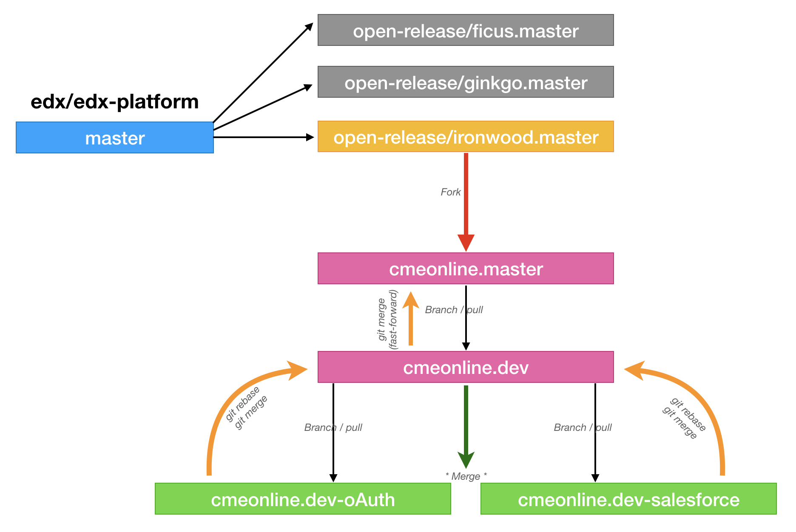

CME Online  Open edX Platform Fork
This is the main edX platform which consists of LMS and Studio.

Installation / Updates (as per Lawrence McDaniel)
------------

*Add any changes to /edx/app/edx_ansible/server-vars.yml*

.. code-block:: bash

  sudo ./edx.platform-stop.sh
  sudo rm -rf /edx/app/edxapp/edx-platform
  sudo /edx/bin/update edx-platform cmeonline.master
  sudo ./edx.install-theme.sh
  sudo ./edx.install-config.sh
  sudo ./edx.compile-assets.sh
  sudo ./edx.platform-restart-full.sh

Custom Modules (as per Lawrence McDaniel)
------------

Git Work Flow
------------

Work with a feature branch off cmeonline.master
------------
.. code-block:: bash

  # how to create a new feature branch named "cmeonline.master-oauth" from cmeonline.master
  git checkout -b cmeonline.master-oauth cmeonline.master
  git branch --set-upstream-to=origin/open-release/ironwood.master cmeonline.master

  # How to merge cmeonline.master-oauth modifications into cmeonline.master
  git checkout cmeonline.master
  git pull                            # to synch your local repo with remote
  git checkout cmeonline.master-oauth
  git pull                            # to sunch your locla repo with remote
  git rebase -i cmeonline.master           # rebase cmeonline.master-oauth to cmeonline.master
  git checkout cmeonline.master
  git merge cmeonline.master-oauth         # merge cmeonline.master-oauth into cmeonline.master

  # Push your changes to Github
  git push origin cmeonline.master
  git push origin cmeonline.master-oauth

Merge cmeonline.dev into cmeonline.master
------------
.. code-block:: bash

  git checkout querium.dev
  git pull                            # to synch your local repo with remote
  git checkout cmeonline.dev
  git pull                            # to sunch your local repo with remote
  git rebase -i cmeonline.master        # rebase cmeonline.master to querium.master
  git checkout cmeonline.master
  git merge cmeonline.master               # merge cmeonline.master into querium.master

  # Push your changes to Github
  git push origin cmeonline.master
  git push origin cmeonline.dev

Deployment Notes
-------
This fork will not install "cleanly" due to UI customizations that are not themeable. Because of these file modifications Paver will compile successfully only when the custom theme for this fork is also installed and configured.
Other stuff that is prone to challenges:
1. RabbitMQ initially caused problems on roverbyopenstax.com and had to be installed. Oddly, most celery tasks worked correctly. Only write operations to Mongo were problematic
2. Assets have to be compiled using our own compiler scripts, located in the config repos
3. Letsencrypt ssl certificates have to be hand replaced.
4. It's not a bad idea to search the code base and the custom theme for hard-coded domain names, as these tend to creep into the code on a regular basis.

License
-------

The code in this repository is licensed under version 3 of the AGPL
unless otherwise noted. Please see the `LICENSE`_ file for details.

.. _LICENSE: https://github.com/edx/edx-platform/blob/master/LICENSE

Documentation
-------------

Documentation details can be found in the `docs index.rst`_.

.. _docs index.rst: docs/index.rst
