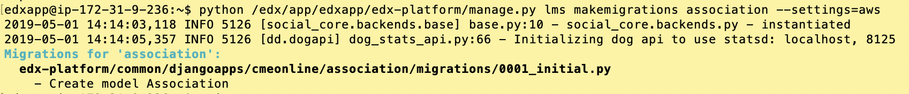

# CME Online: Customizations for User table


Installation
--------
1. Copy this folder into /edx/app/edxapp/edx-platform/common/djangoapps/

2. add the following to lms.env.json
    ```
    "ADDL_INSTALLED_APPS": [
           "cmeonline.association"
        ],
    ```
    

3. [DELETE?] Add the following to /edx/app/edxapp/edx-platform/cms/urls.py on or around row 35

4. Run initial database migrations with this command. This is a Django thing to complete the app "registration").
    ```
    sudo -H -u edxapp -s bash
    cd ~
    source /edx/app/edxapp/edxapp_env
    python /edx/app/edxapp/edx-platform/manage.py lms makemigrations association --settings=aw
    ```
    


4. Run full Open edX migrations with this command from the Ubuntu command line as root
    ```
    sudo /home/ubuntu/edx.platform-migrations.sh
    ```
    


If everything worked successfully then you should find a new field in the User screen of the Django Admin Console:


